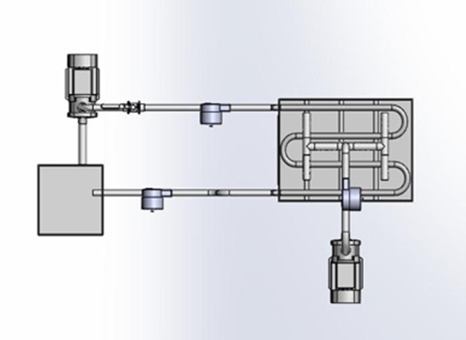

## Project Overview

The cooling tower is a vital equipment for the Direct Current converter station. The heat transfer performance determines whether the valve cooling system can operate safely and stably. The fouling problem of the cooling tower coil and packing seriously affects the heat transfer performance of the cooling tower. 
In recent years, the understanding of fouling hazards has gradually deepened worldwide, and preliminary research has been conducted on the mechanism of scale formation and measures against scale. However, at present, many converter stations in China lack control of the quality of the spray water. The water treatment system or the water treatment system is not perfect, resulting in different degrees of scaling of the cooling tower coil and the packing, failing to establish the water quality of the spray water. The connection with the cooling rate of the cooling tower coil can not achieve the purpose of fault prediction, causing a large number of economic losses and safety hazards to the valve cooling system. Therefore, it is necessary to further study the scaling problem of the cooling system coil of the valve cooling system.

## Research Procedure

In this project, through the dynamic simulation experiment of circulating cooling water, the related research on the fouling tendency of the cooling coil and the analysis of the ionic composition, the evaluation of the scaling rate and the prediction of fouling are carried out. The specific work is as follows:
- Comparing the water quality of industrial tap water treated by nano-filtration and reverse osmosis and the untreated industrial tap water during the experimental period and the effect on coil fouling, it is pointed out that it is necessary to apply a reasonable water treatment scheme for spray water. 
- The ionic components of the spray water before and after the system operation and the supersaturating of the related ions Ca2+, Mg2+, CO3- and SO42- were analyzed, and the composition of the scale was determined. The circulating cooling water was analyzed according to the water quality indexes such as LSI, RSI and PSI. The tendency of water quality scaling in the system operation cycle indicates that the fouling tendency is most obvious when the system does not reach the concentration ratio and the water quality is unstable.
- Monitoring and controlling the inlet and outlet temperature, pressure, flow and other parameters of the internal and external cold water of the circulating cooling water system, recording the change of the thermal resistance of the coil during the operation cycle, and confirming the results of the analysis of the scaling tendency of the water.
- Taking the water quality parameters and the experimental data of the thermal resistance as the research object, the growth rate of the thermal resistance of the dirt was predicted. Based on the theory of regression analysis and time series analysis, the MVR-ARIMAX (multiple regression self-moving average) model was established to determine the main factors affecting scaling. It is proved that the ARIMAX model can monitor the water quality environment of the valve cooling system. The fouling of the pipe is subject to short-term macro predictions.

